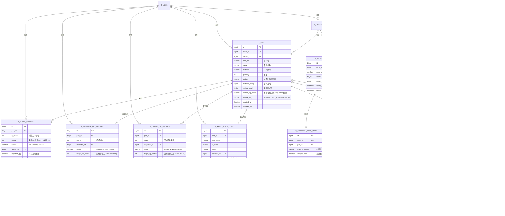

# 机加工生产管理系统 — 数据库设计

## 1. 业务概述

本系统用于管理机加工零件的**全生命周期**。一个订单可包含多个零件，每个零件独立流转。核心采用**状态机**模式驱动推进：

```
备料 ─┐
      ├─→ 待生产 → 生产中 → 待内部质检 ┬→ 内部合格 → 待送货 → 送货中 → 待甲方验收 → 完工
排工序─┘                                ├→ 返修 ──→ (回到指定工序报功) ──→ 待内部质检
                                        └→ 重做 ──→ (回到排工序) ──→ 待生产
                                                       甲方不合格时标"甲方返工"
```

关键决策：
- **备料与排工序并行**：各自独立推进，都 `ready` 才进入"待生产"
- **报功按工序颗粒度**：一道序报功一次，全部工序报功完才推进状态
- **返工目标由人定**：QC 失败时由质检员决定回哪道序（返修）或回排工序（重做）
- **甲方返工独立标记**：便于追溯和考核

## 2. 核心实体

| 实体 | 含义 |
|---|---|
| `TOrder` | 订单（已存在，外键用户） |
| `TPart` | 零件 — 状态机的**作用对象** |
| `TMaterialPrep` | 备料单（订单维度；预留与零件挂接） |
| `TMaterialPrepItem` | 备料单物料明细 |
| `TPartRouting` | 工艺路线（零件级，一次性排产） |
| `TProcessStep` | 工序明细 |
| `TWorkReport` | 工人报功记录（按工序） |
| `TInternalQcRecord` | 内部质检结果 |
| `TClientQcRecord` | 甲方验收结果 |
| `TReworkDirective` | 返工/重做指令 |
| `TDelivery` | 送货记录 |
| `TPartStateLog` | 零件状态变更历史（审计用） |
| `TUser` | 用户（已存在） |

## 3. ER 图



## 4. 表结构详情

### 4.1 `t_part`（零件 — 状态机主表）

| 字段 | 类型 | 必填 | 默认 | 说明 |
|---|---|---|---|---|
| id | BIGINT UNSIGNED | 是 | AUTO_INCREMENT | 主键 |
| order_id | BIGINT UNSIGNED | 是 | — | 所属订单 |
| owner_id | BIGINT UNSIGNED | 是 | — | 责任人(工艺工程师) |
| part_no | VARCHAR(64) | 是 | — | 零件图号 |
| name | VARCHAR(128) | 是 | — | 零件名称 |
| material | VARCHAR(64) | 否 | NULL | 材料牌号 |
| spec | VARCHAR(255) | 否 | NULL | 规格/技术要求 |
| quantity | INT UNSIGNED | 是 | 1 | 生产数量 |
| status | VARCHAR(32) | 是 | `PENDING_PREP` | **状态机当前状态** |
| material_ready | TINYINT(1) | 是 | 0 | 备料是否就绪 |
| routing_ready | TINYINT(1) | 是 | 0 | 排工序是否就绪 |
| rework_flag | VARCHAR(32) | 是 | `NONE` | `NONE`/`CLIENT_REWORK`/`REDO` |
| version | INT UNSIGNED | 是 | 1 | 乐观锁 |
| created_at | DATETIME | 是 | NOW() | |
| updated_at | DATETIME | 是 | NOW() | ON UPDATE NOW() |

**索引**：
- PRIMARY KEY (id)
- INDEX idx_order (order_id)
- INDEX idx_status (status)
- INDEX idx_owner (owner_id)

**业务规则**：
- `status` 只允许取 `PartStatus` 枚举值
- `material_ready ∧ routing_ready = 1` 时，状态机可触发 `READY_TO_PRODUCE`
- `rework_flag = CLIENT_REWORK` 表示此零件经历过甲方返工，便于考核与追溯

### 4.2 `t_material_prep`（备料单）

| 字段 | 类型 | 必填 | 默认 | 说明 |
|---|---|---|---|---|
| id | BIGINT UNSIGNED | 是 | AUTO | 主键 |
| order_id | BIGINT UNSIGNED | 是 | — | |
| prep_no | VARCHAR(32) | 是 | — | 备料单号(业务唯一) |
| ready | TINYINT(1) | 是 | 0 | 全部备齐 |
| ready_by | BIGINT UNSIGNED | 否 | NULL | 备齐操作人 |
| ready_at | DATETIME | 否 | NULL | |
| remark | VARCHAR(255) | 否 | NULL | |
| created_at | DATETIME | 是 | NOW() | |

**索引**：PK(id); UNIQUE uk_prep_no (prep_no); INDEX idx_order (order_id)

### 4.3 `t_material_prep_item`（备料单物料）

| 字段 | 类型 | 必填 | 默认 | 说明 |
|---|---|---|---|---|
| id | BIGINT UNSIGNED | 是 | AUTO | 主键 |
| prep_id | BIGINT UNSIGNED | 是 | — | |
| part_id | BIGINT UNSIGNED | 是 | — | 关联到零件 |
| material_grade | VARCHAR(64) | 是 | — | |
| qty_required | DECIMAL(12,3) | 是 | — | |
| qty_ready | DECIMAL(12,3) | 是 | 0 | |
| ready | TINYINT(1) | 是 | 0 | 本行备齐 |

**索引**：PK(id); INDEX idx_prep (prep_id); INDEX idx_part (part_id)

**业务规则**：
- 备料单 `ready` 由明细聚合得出：`MIN(item.ready) = 1` ⇒ `prep.ready = 1`
- 预留：未来追加"领料出库"时，本表加 `outbound_id` 外键即可

### 4.4 `t_part_routing`（工艺路线）

| 字段 | 类型 | 必填 | 默认 | 说明 |
|---|---|---|---|---|
| id | BIGINT UNSIGNED | 是 | AUTO | 主键 |
| part_id | BIGINT UNSIGNED | 是 | — | |
| version | INT UNSIGNED | 是 | 1 | 排产方案版本 |
| active | TINYINT(1) | 是 | 1 | 当前生效方案(支持重排) |
| created_at | DATETIME | 是 | NOW() | |

**索引**：PK(id); UNIQUE uk_part_active (part_id, active) WHERE active=1 — 同一零件只能有一个生效方案
- 普通 INDEX idx_part (part_id)

### 4.5 `t_process_step`（工序）

| 字段 | 类型 | 必填 | 默认 | 说明 |
|---|---|---|---|---|
| id | BIGINT UNSIGNED | 是 | AUTO | 主键 |
| routing_id | BIGINT UNSIGNED | 是 | — | |
| op_index | INT UNSIGNED | 是 | — | 工序序号，从 1 开始 |
| op_name | VARCHAR(64) | 是 | — | 工序名 |
| std_hours | DECIMAL(8,2) | 否 | NULL | 标准工时 |
| required_skill | VARCHAR(64) | 否 | NULL | 所需技能(可对接工人技能表) |

**索引**：PK(id); UNIQUE uk_routing_op (routing_id, op_index); INDEX idx_routing (routing_id)

### 4.6 `t_work_report`（报功记录）

| 字段 | 类型 | 必填 | 默认 | 说明 |
|---|---|---|---|---|
| id | BIGINT UNSIGNED | 是 | AUTO | 主键 |
| part_id | BIGINT UNSIGNED | 是 | — | |
| routing_id | BIGINT UNSIGNED | 是 | — | 冗余：报功时锁定工艺方案 |
| op_index | INT UNSIGNED | 是 | — | 报功的工序序号 |
| round | INT UNSIGNED | 是 | 1 | 轮次(首次=1,一次返工=2...) |
| source | VARCHAR(16) | 是 | `INTERNAL` | `INTERNAL` / `CLIENT`(甲方返工) |
| worker_id | BIGINT UNSIGNED | 是 | — | |
| reported_qty | DECIMAL(12,3) | 是 | — | 本次报功数量 |
| actual_hours | DECIMAL(8,2) | 否 | NULL | |
| reported_at | DATETIME | 是 | NOW() | |
| remark | VARCHAR(255) | 否 | NULL | |

**索引**：PK(id); UNIQUE uk_part_op_round (part_id, op_index, round) — 同一零件同一工序同一轮次只能报一次
- INDEX idx_part (part_id); INDEX idx_worker (worker_id)

**业务规则**：
- 状态机订阅"某工序是否已报功且 qty ≥ part.quantity"事件
- 所有工序都达成 ⇒ 触发 `WORK_REPORT_DONE` 事件，推进到 `PENDING_INTERNAL_QC`

### 4.7 `t_internal_qc_record`（内部质检）

| 字段 | 类型 | 必填 | 默认 | 说明 |
|---|---|---|---|---|
| id | BIGINT UNSIGNED | 是 | AUTO | 主键 |
| part_id | BIGINT UNSIGNED | 是 | — | |
| round | INT UNSIGNED | 是 | — | 第几轮质检 |
| inspector_id | BIGINT UNSIGNED | 是 | — | 质检员 |
| result | VARCHAR(16) | 是 | — | `PASS` / `REWORK` / `REDO` |
| target_op_index | INT UNSIGNED | 否 | NULL | REWORK 时必填：回哪道序 |
| reason | VARCHAR(500) | 否 | NULL | 不合格原因 |
| inspected_at | DATETIME | 是 | NOW() | |

**索引**：PK(id); INDEX idx_part (part_id); UNIQUE uk_part_round (part_id, round)

### 4.8 `t_client_qc_record`（甲方验收）

字段结构与 `t_internal_qc_record` 相同，但语义是"甲方"。复用一个 schema（合并到 `t_qc_record` 加 `source` 字段也可；本设计保持拆分清晰）。

**索引**：PK(id); INDEX idx_part (part_id); UNIQUE uk_part_round (part_id, round)

### 4.9 `t_rework_directive`（返工指令）

| 字段 | 类型 | 必填 | 默认 | 说明 |
|---|---|---|---|---|
| id | BIGINT UNSIGNED | 是 | AUTO | 主键 |
| part_id | BIGINT UNSIGNED | 是 | — | |
| from_source | VARCHAR(16) | 是 | — | `INTERNAL` / `CLIENT` |
| qc_record_id | BIGINT UNSIGNED | 否 | NULL | 关联质检记录(可空，便于非质检触发的返工) |
| directive | VARCHAR(16) | 是 | — | `REWORK` / `REDO` |
| target_op_index | INT UNSIGNED | 否 | NULL | REWORK 时必填 |
| fulfilled | TINYINT(1) | 是 | 0 | 是否已执行完毕 |
| created_at | DATETIME | 是 | NOW() | |

**索引**：PK(id); INDEX idx_part (part_id)

### 4.10 `t_delivery`（送货）

| 字段 | 类型 | 必填 | 默认 | 说明 |
|---|---|---|---|---|
| id | BIGINT UNSIGNED | 是 | AUTO | 主键 |
| part_id | BIGINT UNSIGNED | 是 | — | |
| delivery_no | VARCHAR(32) | 是 | — | 送货单号 |
| scheduled_at | DATETIME | 否 | NULL | 计划发货时间 |
| shipped_at | DATETIME | 否 | NULL | 实际发货时间 |
| carrier_id | BIGINT UNSIGNED | 否 | NULL | 承运人/司机 |
| tracking_no | VARCHAR(64) | 否 | NULL | 运单号 |
| remark | VARCHAR(255) | 否 | NULL | |

**索引**：PK(id); UNIQUE uk_delivery_no (delivery_no); INDEX idx_part (part_id)

### 4.11 `t_part_state_log`（状态变更历史）

| 字段 | 类型 | 必填 | 默认 | 说明 |
|---|---|---|---|---|
| id | BIGINT UNSIGNED | 是 | AUTO | 主键 |
| part_id | BIGINT UNSIGNED | 是 | — | |
| from_state | VARCHAR(32) | 是 | — | |
| to_state | VARCHAR(32) | 是 | — | |
| event | VARCHAR(32) | 是 | — | 触发事件名 |
| operator_id | BIGINT UNSIGNED | 否 | NULL | |
| context_json | JSON | 否 | NULL | 事件参数快照 |
| created_at | DATETIME | 是 | NOW() | |

**索引**：PK(id); INDEX idx_part_time (part_id, created_at)

**业务规则**：所有状态变更**必须在同一事务内**写入此表，事务失败回滚则状态不变更。

## 5. 关系说明

- **TOrder 1:N TPart** — 一个订单可包含多个零件，零件状态独立
- **TOrder 1:N TMaterialPrep 1:N TMaterialPrepItem N:1 TPart** — 备料单可对应多个零件的物料
- **TPart 1:N TPartRouting 1:N TProcessStep** — 工艺方案按版本管理，每次排产/重排生成新 version
- **TPart 1:N TWorkReport** — 报功按工序×轮次
- **TPart 1:N TInternalQcRecord / TClientQcRecord** — 多轮质检/验收
- **TPart 1:N TReworkDirective** — 每次返工生成一条指令
- **TPart 1:N TDelivery** — 一个零件可分多批送（默认一次）
- **TPart 1:N TPartStateLog** — 状态历史只增不改，便于审计

## 6. 状态机引擎（应用层设计）

### 6.1 引擎结构

```python
# state_machine.py
class PartEvent(str, Enum):
    SUBMIT_MATERIAL_PREP = "SUBMIT_MATERIAL_PREP"
    MATERIAL_READY = "MATERIAL_READY"
    SUBMIT_ROUTING = "SUBMIT_ROUTING"
    ROUTING_READY = "ROUTING_READY"
    START_PRODUCTION = "START_PRODUCTION"
    WORK_REPORT = "WORK_REPORT"
    SUBMIT_INTERNAL_QC = "SUBMIT_INTERNAL_QC"
    QC_PASS = "QC_PASS"
    QC_FAIL_REWORK = "QC_FAIL_REWORK"
    QC_FAIL_REDO = "QC_FAIL_REDO"
    SCHEDULE_DELIVERY = "SCHEDULE_DELIVERY"
    SHIP = "SHIP"
    CLIENT_QC_PASS = "CLIENT_QC_PASS"
    CLIENT_QC_FAIL = "CLIENT_QC_FAIL"
    CANCEL = "CANCEL"

TRANSITIONS: dict[tuple[PartStatus, PartEvent], PartStatus | Callable] = {
    (PENDING_PREP, SUBMIT_MATERIAL_PREP): PREPARING_MATERIAL,
    (PENDING_PREP, SUBMIT_ROUTING): PREPARING_ROUTING,
    (PREPARING_MATERIAL, MATERIAL_READY): _check_both_ready,  # 守卫函数
    (PREPARING_ROUTING, ROUTING_READY): _check_both_ready,
    (READY_TO_PRODUCE, START_PRODUCTION): IN_PRODUCTION,
    (IN_PRODUCTION, WORK_REPORT): _check_all_reported,  # 守卫函数
    (PENDING_INTERNAL_QC, QC_PASS): READY_FOR_DELIVERY,
    (PENDING_INTERNAL_QC, QC_FAIL_REWORK): IN_REWORK,
    (PENDING_INTERNAL_QC, QC_FAIL_REDO): IN_REDO,
    (IN_REWORK, WORK_REPORT): _check_rework_done,
    (IN_REDO, ROUTING_READY): READY_TO_PRODUCE,
    (READY_FOR_DELIVERY, SCHEDULE_DELIVERY): IN_TRANSIT,
    (IN_TRANSIT, SHIP): PENDING_CLIENT_QC,
    (PENDING_CLIENT_QC, CLIENT_QC_PASS): COMPLETED,
    (PENDING_CLIENT_QC, CLIENT_QC_FAIL): _route_client_qc_fail,
}
```

### 6.2 守卫函数（Guard）

- `_check_both_ready(part)`：检查 `material_ready ∧ routing_ready`，否则不转移（备料/排工序可继续并行）
- `_check_all_reported(part, ctx)`：检查所有工序都已报功且数量满足，否则保持 `IN_PRODUCTION`
- `_check_rework_done(part, ctx)`：检查返修的目标工序报功是否完成
- `_route_client_qc_fail(part, ctx)`：根据 `target_op_index` 决定走 `IN_REWORK` 还是 `IN_REDO`，并设置 `rework_flag = CLIENT_REWORK`

### 6.3 关键不变量

1. **状态变更与历史日志同事务**：写入 `t_part` 后必须写入 `t_part_state_log`，否则 rollback
2. **乐观锁**：`t_part.version` 每次更新 +1，防止并发状态变更
3. **事件先于副作用**：先验证转移合法性，再更新状态，最后写日志
4. **返工目标必须存在**：`target_op_index` 必须在该零件的工艺方案 `op_index` 集合内

## 7. 扩展性考虑

| 未来需求 | 现有应对 |
|---|---|
| 领料出库 | `t_material_prep_item` 加 `outbound_id` 外键 + 新建 `t_outbound` |
| 多角色/权限 | `TUser` 加 `role` 字段 + 中间表 `t_user_role` |
| 工人技能匹配 | `TProcessStep.required_skill` 已预留，对接 `t_worker_skill` |
| 排产日历/产能 | 新建 `t_workshop_capacity`，状态机不感知 |
| 工序并行 | `TProcessStep` 加 `parallel_group` 字段，状态机按 group 推进 |
| 客户(甲方)管理 | 新建 `t_client`，`TOrder.client_id` 外键 |
| 报表/看板 | `t_part_state_log` 已结构化，可做 OLAP 抽取 |

## 8. 与现有代码的衔接

- 复用 `TUser` / `TOrder`：在 `TOrder` 上加 `client_id` 字段（非必须），给 `TPart` 留好 `order_id` 外键
- 命名沿用 `t_xxx` 蛇形风格
- 主键 BIGINT UNSIGNED + AUTO_INCREMENT（现有风格）
- 状态字段用 VARCHAR(32)（与现有 `t_order` 风格一致，避免 MySQL ENUM 改值麻烦）
- 时间字段：DATETIME + `DEFAULT CURRENT_TIMESTAMP` + `ON UPDATE CURRENT_TIMESTAMP`
- 状态机引擎放在 `service/part_state_machine.py`，被各 service 调用
- Repository 模式继续沿用：每个新表对应一个 repository
