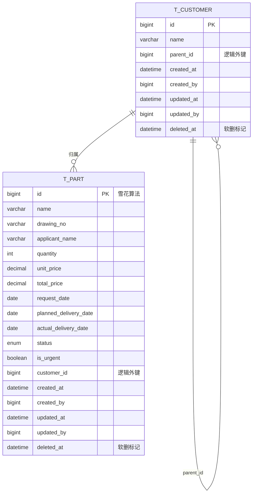

# 零件 / 客户 数据设计

> 适用范围：覆盖法拉电子、路达两家一级客户的零件加工订单主数据。
> 依据来源：`docs/example/2026年法拉生产明细表最新.xlsx`、`docs/example/2026路达加工明细.xlsx.xls`。
> 已确认的关键决策（来自需求方）：
> 1. `t_part.customer_id` 指向 **二级节点**（具体分厂/部门），非一级集团。
> 2. `applicant_name` 直接存字符串，不关联用户表。
> 3. 仅保留一个 `名称` 字段（对应品名/零件名称）。
> 4. 订单状态枚举：`待生产 / 生产中 / 品检中 / 待送货 / 已送货 / 返修中 / 已完成 / 已取消`。
> 5. **不使用物理外键** —— 所有跨表引用都是普通列 + 普通索引；引用完整性、级联策略、防自环等都在 service 层处理。
> 6. **所有表都有审计字段**：`created_at / created_by / updated_at / updated_by / deleted_at`，由 `model/base.Base` 统一声明，所有 model 自动继承。
> 7. `t_part` 加 `is_urgent` 字段（是否加急）；列表查询支持按 `drawing_no` / `name` 模糊匹配，并按 `is_urgent` / `status` 过滤、按 `planned_delivery_date` 排序。

---

## 1. 业务概述

系统服务于"零件加工订单管理"场景：客户（法拉电子旗下分厂、路达旗下部门）发起加工请求，
由内部申请人跟进图号、生产、品质、交付全流程。

核心场景：
- **录入**：拿到客户订单后，将每条零件明细（品名、图号、数量、单价、交期）落库。
- **跟进**：随生产进度更新状态（生产中 → 品检 → 待送货 → 已送货 → 已完成）；返修时进入"返修中"。
- **查询**：按客户维度（某分厂的待交付）、按时间维度（本周计划交期）、按图号维度（复用件历史）。
- **统计**：按一级客户归集金额、计算准时交付率等。

---

## 2. 核心实体

| 实体 | 表 | 一句话描述 |
|---|---|---|
| 客户 | `t_customer` | 客户树节点（一级集团 / 二级分厂或部门），自引用邻接表 |
| 零件订单 | `t_part` | 一条零件加工/生产明细，包含金额、日期、状态 |

> 申请人不单独建表——同名同岗位的"林雪强"在两个客户下都出现过，且没有用户体系诉求，
> 以字符串直接落库最经济（参见决策 #2）。

---

## 3. ER 图



---

## 4. 表结构详情

### 4.1 `t_customer` 客户树

| 字段 | 类型 | 必填 | 默认值 | 说明 |
|---|---|---|---|---|
| id | BIGINT | 是 | AUTO_INCREMENT | 主键，自增 |
| name | VARCHAR(100) | 是 | — | 客户名称，如"法拉电子"、"母排厂"、"开发一部197" |
| parent_id | BIGINT | 否 | NULL | **逻辑**父节点 id（无 DB 外键）；service 层校验存在性、防自环 |
| created_at | DATETIME | 是 | `now()` | 创建时间（审计字段，Base 声明） |
| created_by | BIGINT | 否 | NULL | 创建人 id（审计字段，Base 声明） |
| updated_at | DATETIME | 是 | `now()` on update | 更新时间（审计字段，Base 声明） |
| updated_by | BIGINT | 否 | NULL | 最后修改人 id（审计字段，Base 声明） |
| deleted_at | DATETIME | 否 | NULL | 软删时间，非空表示已删除（审计字段，Base 声明） |

**索引**
- PRIMARY KEY (`id`)
- INDEX `ix_t_customer_name` (`name`) — 按名查找
- INDEX `ix_t_customer_parent_id` (`parent_id`) — 取子树
- INDEX `ix_t_customer_deleted_at` (`deleted_at`) — 软删过滤

**约束**
- CHECK `parent_id IS NULL OR parent_id <> id` — 防止单行自引用成环（不替代 service 层做整树成环检测）

**业务规则**
- 层级理论上不限制，由应用层控制（当前业务仅 2 级，一级=集团，二级=分厂/部门）。
- 树形结构使用 **邻接表**（adjacency list）。如未来需要一次取整棵子树，可在使用方做递归 CTE；现版本不预建 path 列。

---

### 4.2 `t_part` 零件订单

| 字段 | 类型 | 必填 | 默认值 | 说明 |
|---|---|---|---|---|
| id | BIGINT | 是 | 雪花 ID | 主键，由 `utils.id_gen.new_id()` 生成 |
| name | VARCHAR(200) | 是 | — | 零件/品名，如"C3600672J003绝缘纸折弯工装" |
| drawing_no | VARCHAR(100) | 是 | — | 图号，如"E42804FZJ076100"、"LT16681" |
| applicant_name | VARCHAR(50) | 是 | — | 申请人姓名，存字符串 |
| quantity | INT | 是 | 1 | 数量 |
| unit_price | DECIMAL(12,2) | 是 | 0 | 单价（元） |
| total_price | DECIMAL(14,2) | 是 | 0 | 总价（元）。建议写入时由 `quantity × unit_price` 计算，但允许手工覆盖（如议价） |
| request_date | DATE | 是 | — | 请购日期 |
| planned_delivery_date | DATE | 是 | — | 计划交期 |
| actual_delivery_date | DATE | 否 | NULL | 送货日期（实际）。`status=DELIVERED` 后由系统或人工回填 |
| status | ENUM(part_status) | 是 | `PENDING` | 见 4.3 |
| is_urgent | BOOLEAN | 是 | false | 是否加急；用于加急看板、列表置顶 |
| customer_id | BIGINT | 是 | — | **逻辑**外键，指向 `t_customer.id` 的叶子节点（无 DB 外键）；service 层校验存在性 |
| created_at | DATETIME | 是 | `now()` | 创建时间（审计字段，Base 声明） |
| created_by | BIGINT | 否 | NULL | 创建人 id（审计字段，Base 声明） |
| updated_at | DATETIME | 是 | `now()` on update | 更新时间（审计字段，Base 声明） |
| updated_by | BIGINT | 否 | NULL | 最后修改人 id（审计字段，Base 声明） |
| deleted_at | DATETIME | 否 | NULL | 软删时间，非空表示已删除（审计字段，Base 声明） |

**索引**
- PRIMARY KEY (`id`)
- INDEX `ix_t_part_name` (`name`) — 模糊查询支撑
- INDEX `ix_t_part_drawing_no` (`drawing_no`) — 模糊查询支撑、复用件历史追溯
- INDEX `ix_t_part_customer_id` (`customer_id`) — 按客户过滤
- INDEX `ix_t_part_status` (`status`) — 看板/未完成列表
- INDEX `ix_t_part_is_urgent` (`is_urgent`) — 加急筛选
- INDEX `ix_t_part_request_date` (`request_date`)
- INDEX `ix_t_part_planned_delivery_date` (`planned_delivery_date`) — 交期排序
- INDEX `ix_t_part_deleted_at` (`deleted_at`) — 软删过滤
- COMPOSITE INDEX `ix_t_part_customer_status_delivery` (`customer_id`, `status`, `planned_delivery_date`) — 高频看板"某客户某状态按交期排序"

**约束**
- 无 DB 外键。删除客户前 service 必须先检查其下是否有 `t_part` 记录（避免悬空引用）。

**业务规则**
- `total_price` 不在 DB 层用 generated column 计算，保留为冗余字段以便记录议价/手工调整后的金额。
- 状态机见 4.3，越权跳转由应用层校验。

---

### 4.3 `part_status` 枚举

| 值 | 中文 | 含义 |
|---|---|---|
| `PENDING` | 待生产 | 刚录入 |
| `IN_PROCESS` | 生产中 | 车间已开工 |
| `INSPECTION` | 品检中 | 进入品质检验 |
| `READY_TO_SHIP` | 待送货 | 品检通过、待发运 |
| `DELIVERED` | 已送货 | 实际送达（`actual_delivery_date` 应已填） |
| `REPAIRING` | 返修中 | 品检或售后发现不合格，进入返修 |
| `COMPLETED` | 已完成 | 客户已签收/验收通过，结案 |
| `CANCELLED` | 已取消 | 任何阶段都可取消 |

合法流转（应用层校验）：
```
PENDING → IN_PROCESS → INSPECTION → READY_TO_SHIP → DELIVERED → COMPLETED
任意状态 → REPAIRING → IN_PROCESS（再走一轮）
任意状态 → CANCELLED
```

---

### 4.4 审计字段（Base 统一声明）

所有表通过继承 `model.base.Base` 自动获得以下字段，无需在子类重复声明：

| 字段 | 类型 | 必填 | 默认值 | 说明 |
|---|---|---|---|---|
| created_at | DATETIME | 是 | `now()` | 创建时间，DB 默认值 |
| created_by | BIGINT | 否 | NULL | 创建人 id，当前无用户体系，由调用方传 |
| updated_at | DATETIME | 是 | `now()` on update | 更新时间，DB 自动维护 |
| updated_by | BIGINT | 否 | NULL | 最后修改人 id，由调用方传 |
| deleted_at | DATETIME | 否 | NULL | 软删时间。NULL = 未删除，非空 = 已删除时间 |

**约定**
- 默认查询条件是 `deleted_at IS NULL`；repository 已经统一处理。
- 删除操作走 `soft_delete(part)`（写 `deleted_at = utcnow()`），**禁止**直接 `session.delete()`。
- `updated_at` 由 SQLAlchemy `onupdate=func.now()` 自动维护；`updated_by` 必须在 service 层显式赋值。

---

### 4.5 查询与过滤

`PartRepository.list_with_filters(...)` 是零件列表的统一入口，支持：

| 参数 | 类型 | 行为 |
|---|---|---|
| `customer_id` | int \| None | 精确匹配 |
| `status` | `PartStatus` \| None | 精确匹配 |
| `is_urgent` | bool \| None | `True` 只看加急；`False` 只看非加急 |
| `drawing_no_like` | str \| None | 大小写不敏感模糊匹配（`ILIKE %x%`） |
| `name_like` | str \| None | 大小写不敏感模糊匹配 |
| `sort_by` | `PartSortKey` | 默认 `PLANNED_DELIVERY_DATE`，可选 `REQUEST_DATE` / `CREATE_AT` |
| `sort_dir` | `SortDir` | `ASC` / `DESC`，默认 `ASC` |
| `include_deleted` | bool | 默认 `False`，自动加 `deleted_at IS NULL` |
| `limit` / `offset` | int | 分页，默认 `limit=50` |

配套 `count_with_filters(...)` 用于分页总条数。

示例：
```python
# 母排厂下所有加急、待生产的零件，按交期升序
parts = await repo.list_with_filters(
    customer_id=母排厂id,
    status=PartStatus.PENDING,
    is_urgent=True,
    sort_by=PartSortKey.PLANNED_DELIVERY_DATE,
    sort_dir=SortDir.ASC,
)
```

---

## 5. 关系说明

- **t_customer 自引用**：通过 `parent_id` 形成树。一级集团（`parent_id IS NULL`）下挂多个分厂/部门（二级）。
  整棵树理论上可扩展到多级（不在 DB 层限制）。

- **t_customer → t_part (1:N)**：一条零件明细只属于一个客户节点。
  按决策 #1，`customer_id` 始终指向 **叶子节点**——例如"母排厂林雪强下单的零件"挂在"母排厂"下。
  若需要按一级集团（法拉电子）汇总，需用递归 CTE 上卷。

  ```sql
  -- 例：查 2026 年法拉电子所有零件金额合计
  WITH RECURSIVE fara_tree AS (
    SELECT id FROM t_customer WHERE name = '法拉电子'
    UNION ALL
    SELECT c.id FROM t_customer c JOIN fara_tree t ON c.parent_id = t.id
  )
  SELECT SUM(p.total_price)
  FROM t_part p JOIN fara_tree t ON p.customer_id = t.id
  WHERE p.request_date BETWEEN '2026-01-01' AND '2026-12-31';
  ```

---

## 6. 扩展性考虑

| 未来可能的变化 | 当前设计的应对 |
|---|---|
| 申请人要做账号体系、权限分配 | `applicant_name` 已为字符串，需要时可迁移为 `applicant_id` FK 新建 t_user 表；旧字段保留做冗余避免破坏历史数据 |
| 客户层级超过 2 级（集团→事业部→分厂→小组） | 邻接表天然支持无限层级。届时可在 `t_customer` 增加 `level TINYINT` 冗余字段以避免每次递归 |
| 状态机再细化（如"待付款"、"待开票"） | 只需往枚举加值，不破坏存量 |
| 金额需要审计轨迹（议价/手工改价） | 新建 `t_part_price_log(part_id, old, new, operator, changed_at)`，本表 `total_price` 保留为当前快照 |
| 同一图号下多个变体（"左/右"、"附报告"等） | 当前 `name` 字段已能装下，如变体爆炸可拆出 `t_part_variant` |
| 要按一级集团直接查 | 用递归 CTE；高频查询可建物化视图 `t_part_with_root_customer` |
| 软删除需求 | 当前未做软删；如需，`t_customer` 和 `t_part` 都加 `deleted_at`，并把 `parent_id` 改为级联 SET NULL |

---

## 7. 交付物清单

| 文件 | 说明 |
|---|---|
| `model/base.py` | `Base`（`__abstract__`），统一声明 5 个审计字段 |
| `model/enums.py` | `PartStatus` 8 值 + `PartSortKey` / `SortDir` 排序枚举 |
| `model/customer.py` | `TCustomer` 邻接表模型（自增 id、逻辑 parent_id） |
| `model/part.py` | `TPart`（雪花 id、二级客户逻辑外键、`is_urgent`） |
| `model/__init__.py` | 清理悬挂导出，新增 TCustomer |
| `repository/part.py` | `PartRepository`：CRUD + `list_with_filters` / `count_with_filters` / `soft_delete` |
| `alembic/versions/a1f9c2d8e3b4_create_t_customer_and_t_part.py` | 初始迁移：建表 + 审计字段 + 索引 + CHECK 约束 |