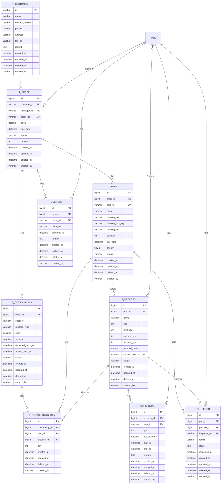

# 非标机加工生产管理系统 — 数据设计 v3

> 本文档是**生产业务模块**的设计。账号/权限模块见 [`db-design-account-management.md`](./db-design-account-management.md)。

## 1. 业务概述

服务于**非标机加工行业**的 ERP 系统。生产特点：**小批量、种类多、按单生产**。

**核心流程**：
1. 经理报价 → 获取订单（`t_order`）
2. 订单拆分零件（`t_part`），每个零件关联一张图纸（OSS 存储）
3. 文员为每个零件排定工序（`t_process`），并打印图纸下发
4. 账号（工人）从"任务池"**主动领取**零件工序（**可分批领取，防超领**）
5. 加工完成后**报工**（`t_work_report`，可分批报）
6. 品检记录检验结果（`t_qc_record`）
7. 订单所有零件完工后，安排送货（`t_delivery`）或外协（`t_outsourcing`）

**核心痛点 & 设计目标**：
- 临近交期漏单 → 订单/零件均有交期，进度可视化
- 工人干了多少难计算 → `t_work_report` 细粒度记录，支撑绩效
- 多种类小批量 → 工序由文员按零件**自定义排定**

## 2. v3 关键变更

| 变更 | 说明 |
|---|---|
| 拆分为两个模块 | 账号/权限 9 张表独立，本文档 9 张表为业务模块 |
| **统一用 `user` 命名** | 不用 `worker`，所有表 `t_user` / `t_user_role` / `t_user_position` 等 |
| 业务表 `user_id` 引用 | 关联 `t_user.id`（`VARCHAR(20)`），具体账号模块见账号文档 |

## 3. 模块划分

```
myERP/
├── module_account/                账号/权限模块（见 db-design-account-management.md）
│   ├── t_department
│   ├── t_position
│   ├── t_user
│   ├── t_user_profile
│   ├── t_user_position
│   ├── t_role
│   ├── t_permission
│   ├── t_role_permission
│   └── t_user_role
│
└── module_production/             生产业务模块（本文档）
    ├── t_customer
    ├── t_order
    ├── t_part
    ├── t_process
    ├── t_work_report
    ├── t_qc_record
    ├── t_delivery
    ├── t_outsourcing
    └── t_outsourcing_item
```

## 4. 核心实体

| 实体 | 含义 | 主键策略 |
|---|---|---|
| Customer (客户) | 下单外部客户 | 工号 |
| Order (订单) | 客户的一次下单 | 雪花 ID |
| Part (零件) | 订单拆解出的加工对象 | 雪花 ID |
| Process (工序) | 零件的加工步骤 | 雪花 ID |
| WorkReport (报工) | 账号完成工序的记录 | 雪花 ID |
| QCRecord (品检) | 工序/成品检验结果 | 雪花 ID |
| Delivery (送货) | 订单完工后的发货记录 | 雪花 ID |
| Outsourcing (外协单) | 委托外部加工 | 雪花 ID |
| OutsourcingItem (外协明细) | 外协单与零件的关联 | 雪花 ID |

**9 张表**

## 5. ER 图



> 图中 `T_USER` 来自账号/权限模块，详见 [db-design-account-management.md](./db-design-account-management.md)。

## 6. 通用约定

### 6.1 主键策略

| 类型 | 表 | 主键类型 | 生成器 | 格式 |
|---|---|---|---|---|
| 工号 | t_customer | `VARCHAR(20)` | `utils/id_generator.py` | `C + YYYY + NNNN` |
| 雪花 ID | t_order / t_part / t_process / t_work_report / t_qc_record / t_delivery / t_outsourcing / t_outsourcing_item | `BIGINT`（有符号） | `utils/snowflake.py` | 数字 |

**外键类型必须与主表主键一致**：
- 关联 `t_customer.id` / `t_user.id` 的 FK：`VARCHAR(20)`
- 关联 `t_order.id` / `t_part.id` / `t_process.id` 的 FK：`BIGINT`

### 6.2 审计字段

每张表都有：
- `created_at DATETIME DEFAULT CURRENT_TIMESTAMP`
- `updated_at DATETIME DEFAULT CURRENT_TIMESTAMP ON UPDATE CURRENT_TIMESTAMP`
- `deleted_at DATETIME DEFAULT NULL` — 软删除标记
- `created_by VARCHAR(20) DEFAULT NULL` — 创建人，关联账号模块的 `t_user.id`

### 6.3 软删除

- 软删除 = `deleted_at` 填时间戳
- 所有业务查询必须过滤 `deleted_at IS NULL`

### 6.4 状态字段

- 一律 `VARCHAR(32)` + 应用层 `Enum` 约束
- 不用 MySQL `ENUM` 类型

## 7. 表结构详情

### 7.1 t_customer（客户）

> 客户**不登录系统**，仅作业务关联。

| 字段 | 类型 | 必填 | 默认值 | 说明 |
|---|---|---|---|---|
| id | VARCHAR(20) | 是 | 工号 `C + YYYY + NNNN` | 主键，例 `C20260001` |
| name | VARCHAR(100) | 是 | — | 客户公司/单位名 |
| contact_person | VARCHAR(50) | 否 | NULL | 联系人 |
| phone | VARCHAR(20) | 否 | NULL | 联系电话 |
| address | VARCHAR(255) | 否 | NULL | 地址 |
| tax_no | VARCHAR(50) | 否 | NULL | 税号 |
| remark | TEXT | 否 | NULL | 备注 |
| created_at | DATETIME | 是 | CURRENT_TIMESTAMP | |
| updated_at | DATETIME | 是 | ON UPDATE | |
| deleted_at | DATETIME | 否 | NULL | |
| created_by | VARCHAR(20) | 否 | NULL | |

**索引**：`PRIMARY KEY (id)`、`INDEX idx_name (name)`、`INDEX idx_phone (phone)`、`INDEX idx_deleted (deleted_at)`

### 7.2 t_order（订单）

| 字段 | 类型 | 必填 | 默认值 | 说明 |
|---|---|---|---|---|
| id | BIGINT | 是 | 雪花 ID | 主键 |
| customer_id | VARCHAR(20) | 是 | — | FK→t_customer.id |
| manager_id | VARCHAR(20) | 是 | — | FK→账号模块 t_user.id，订单负责人 |
| order_no | VARCHAR(50) | 是 | — | 业务订单号（生成器） |
| price | DECIMAL(12,2) | 是 | — | 订单总价 |
| due_date | DATETIME | 是 | — | 订单交期 |
| status | VARCHAR(32) | 是 | 'QUOTING' | 状态 |
| remark | TEXT | 否 | NULL | 备注 |
| created_at | DATETIME | 是 | CURRENT_TIMESTAMP | |
| updated_at | DATETIME | 是 | ON UPDATE | |
| deleted_at | DATETIME | 否 | NULL | |
| created_by | VARCHAR(20) | 否 | NULL | |

**索引**：
- `PRIMARY KEY (id)`
- `UNIQUE KEY uk_order_no (order_no)`
- `INDEX idx_customer (customer_id)`
- `INDEX idx_manager (manager_id)`
- `INDEX idx_due_date (due_date)` — 查"临近交期未完成"
- `INDEX idx_status (status, due_date)` — 主管看板
- `INDEX idx_deleted (deleted_at)`

**状态枚举**：`QUOTING / CONFIRMED / IN_PRODUCTION / PARTIAL_DELIVERED / DELIVERED / CANCELLED`

### 7.3 t_part（零件）

| 字段 | 类型 | 必填 | 默认值 | 说明 |
|---|---|---|---|---|
| id | BIGINT | 是 | 雪花 ID | 主键 |
| order_id | BIGINT | 是 | — | FK→t_order.id |
| part_no | VARCHAR(50) | 是 | — | 零件业务号（生成器） |
| name | VARCHAR(100) | 是 | — | 零件名称 |
| drawing_no | VARCHAR(100) | 否 | NULL | 图纸编号 |
| drawing_oss_key | VARCHAR(255) | 否 | NULL | OSS 存储 key |
| drawing_url | VARCHAR(500) | 否 | NULL | OSS 访问 URL（临时签名） |
| quantity | INT UNSIGNED | 是 | 1 | 零件数量 |
| due_date | DATETIME | 是 | — | 零件交期 |
| priority | TINYINT UNSIGNED | 是 | 3 | 优先级 1-5 |
| status | VARCHAR(32) | 是 | 'PENDING' | 零件状态 |
| created_at | DATETIME | 是 | CURRENT_TIMESTAMP | |
| updated_at | DATETIME | 是 | ON UPDATE | |
| deleted_at | DATETIME | 否 | NULL | |
| created_by | VARCHAR(20) | 否 | NULL | |

**索引**：
- `PRIMARY KEY (id)`
- `UNIQUE KEY uk_part_no (part_no)`
- `INDEX idx_order (order_id)`
- `INDEX idx_due_date (due_date)`
- `INDEX idx_status_due (status, due_date)` — 看板
- `INDEX idx_priority (priority, due_date)`
- `INDEX idx_deleted (deleted_at)`

### 7.4 t_process（工序）★

| 字段 | 类型 | 必填 | 默认值 | 说明 |
|---|---|---|---|---|
| id | BIGINT | 是 | 雪花 ID | 主键 |
| part_id | BIGINT | 是 | — | FK→t_part.id |
| name | VARCHAR(50) | 是 | — | 工序名 |
| seq | INT UNSIGNED | 是 | — | 工序顺序，从 1 开始 |
| total_qty | INT UNSIGNED | 是 | — | 本工序总件数 |
| claimed_qty | INT UNSIGNED | 是 | 0 | 已被领取的件数 |
| finished_qty | INT UNSIGNED | 是 | 0 | 已报工完成件数 |
| planned_hours | DECIMAL(8,2) | 否 | NULL | 计划工时 |
| current_user_id | VARCHAR(20) | 否 | NULL | FK→账号模块 t_user.id，当前主要加工人 |
| status | VARCHAR(32) | 是 | 'PENDING' | 工序状态 |
| created_at | DATETIME | 是 | CURRENT_TIMESTAMP | |
| updated_at | DATETIME | 是 | ON UPDATE | |
| deleted_at | DATETIME | 否 | NULL | |
| created_by | VARCHAR(20) | 否 | NULL | |

**索引**：
- `PRIMARY KEY (id)`
- `INDEX idx_part (part_id, seq)` — 查某零件的工序列表
- `INDEX idx_status (status)`
- `INDEX idx_user (current_user_id, status)` — 查某用户手上的活
- `INDEX idx_deleted (deleted_at)`

**业务规则 — 防超领**：
```sql
BEGIN;
SELECT claimed_qty, total_qty FROM t_process
  WHERE id = ? AND deleted_at IS NULL FOR UPDATE;
-- 校验 claimed_qty + 领量 <= total_qty
UPDATE t_process SET claimed_qty = claimed_qty + ? WHERE id = ?;
COMMIT;
```

**状态枚举**：`PENDING / CLAIMED / IN_PROCESS / DONE / REJECTED`

### 7.5 t_work_report（报工）★

| 字段 | 类型 | 必填 | 默认值 | 说明 |
|---|---|---|---|---|
| id | BIGINT | 是 | 雪花 ID | 主键 |
| process_id | BIGINT | 是 | — | FK→t_process.id |
| user_id | VARCHAR(20) | 是 | — | FK→账号模块 t_user.id |
| qty | INT UNSIGNED | 是 | — | 本次报工数量 |
| actual_hours | DECIMAL(8,2) | 否 | NULL | 本次实际工时 |
| start_at | DATETIME | 否 | NULL | 本次加工开始时间 |
| end_at | DATETIME | 否 | NULL | 本次加工结束时间 |
| remark | TEXT | 否 | NULL | 报工备注 |
| created_at | DATETIME | 是 | CURRENT_TIMESTAMP | |
| updated_at | DATETIME | 是 | ON UPDATE | |
| deleted_at | DATETIME | 否 | NULL | |
| created_by | VARCHAR(20) | 否 | NULL | |

**索引**：
- `PRIMARY KEY (id)`
- `INDEX idx_process (process_id)`
- `INDEX idx_user_time (user_id, created_at)` — **绩效核心索引**
- `INDEX idx_time (created_at)`
- `INDEX idx_deleted (deleted_at)`

### 7.6 t_qc_record（品检记录）

| 字段 | 类型 | 必填 | 默认值 | 说明 |
|---|---|---|---|---|
| id | BIGINT | 是 | 雪花 ID | 主键 |
| part_id | BIGINT | 是 | — | FK→t_part.id |
| process_id | BIGINT | 否 | NULL | FK→t_process.id（NULL = 成品终检） |
| inspector_id | VARCHAR(20) | 是 | — | FK→账号模块 t_user.id，品检员 |
| result | VARCHAR(32) | 是 | — | `PASS / FAIL / REWORK` |
| issue | TEXT | 否 | NULL | 不合格描述 |
| inspected_at | DATETIME | 是 | — | 检验时间 |
| created_at | DATETIME | 是 | CURRENT_TIMESTAMP | |
| updated_at | DATETIME | 是 | ON UPDATE | |
| deleted_at | DATETIME | 否 | NULL | |
| created_by | VARCHAR(20) | 否 | NULL | |

**索引**：
- `PRIMARY KEY (id)`
- `INDEX idx_part (part_id)`
- `INDEX idx_process (process_id)`
- `INDEX idx_result_time (result, inspected_at)` — 品检统计
- `INDEX idx_inspector_time (inspector_id, inspected_at)` — 品检员绩效
- `INDEX idx_deleted (deleted_at)`

### 7.7 t_delivery（送货单）

| 字段 | 类型 | 必填 | 默认值 | 说明 |
|---|---|---|---|---|
| id | BIGINT | 是 | 雪花 ID | 主键 |
| order_id | BIGINT | 是 | — | FK→t_order.id |
| driver_id | VARCHAR(20) | 是 | — | FK→账号模块 t_user.id，司机 |
| plate_no | VARCHAR(20) | 是 | — | 车牌号 |
| delivered_at | DATETIME | 是 | — | 发货时间 |
| remark | TEXT | 否 | NULL | 备注 |
| created_at | DATETIME | 是 | CURRENT_TIMESTAMP | |
| updated_at | DATETIME | 是 | ON UPDATE | |
| deleted_at | DATETIME | 否 | NULL | |
| created_by | VARCHAR(20) | 否 | NULL | |

**索引**：`PRIMARY KEY (id)`、`INDEX idx_order (order_id)`、`INDEX idx_driver (driver_id, delivered_at)`、`INDEX idx_deleted (deleted_at)`

### 7.8 t_outsourcing（外协单）

| 字段 | 类型 | 必填 | 默认值 | 说明 |
|---|---|---|---|---|
| id | BIGINT | 是 | 雪花 ID | 主键 |
| order_id | BIGINT | 是 | — | FK→t_order.id |
| supplier | VARCHAR(100) | 是 | — | 外协供应商 |
| process_type | VARCHAR(50) | 是 | — | 加工类型 |
| cost | DECIMAL(10,2) | 否 | NULL | 费用 |
| sent_at | DATETIME | 是 | — | 发货日期 |
| expected_back_at | DATETIME | 是 | — | 预计回厂日期 |
| actual_back_at | DATETIME | 否 | NULL | 实际回厂日期 |
| status | VARCHAR(32) | 是 | 'SENT' | 状态 |
| created_at | DATETIME | 是 | CURRENT_TIMESTAMP | |
| updated_at | DATETIME | 是 | ON UPDATE | |
| deleted_at | DATETIME | 否 | NULL | |
| created_by | VARCHAR(20) | 否 | NULL | |

**索引**：
- `PRIMARY KEY (id)`
- `INDEX idx_order (order_id)`
- `INDEX idx_status_back (status, expected_back_at)` — 查"该催的外协"
- `INDEX idx_supplier (supplier, sent_at)`
- `INDEX idx_deleted (deleted_at)`

**状态枚举**：`SENT / IN_PROCESS / RECEIVED / CANCELLED`

### 7.9 t_outsourcing_item（外协明细）

| 字段 | 类型 | 必填 | 默认值 | 说明 |
|---|---|---|---|---|
| id | BIGINT | 是 | 雪花 ID | 主键 |
| outsourcing_id | BIGINT | 是 | — | FK→t_outsourcing.id |
| part_id | BIGINT | 是 | — | FK→t_part.id |
| process_id | BIGINT | 否 | NULL | FK→t_process.id |
| qty | INT UNSIGNED | 是 | — | 数量 |
| created_at | DATETIME | 是 | CURRENT_TIMESTAMP | |
| updated_at | DATETIME | 是 | ON UPDATE | |
| deleted_at | DATETIME | 否 | NULL | |
| created_by | VARCHAR(20) | 否 | NULL | |

**索引**：`PRIMARY KEY (id)`、`INDEX idx_outsourcing (outsourcing_id)`、`INDEX idx_part (part_id)`、`INDEX idx_process (process_id)`、`INDEX idx_deleted (deleted_at)`

## 8. 关系说明

| 关系 | 基数 | 业务含义 |
|---|---|---|
| T_CUSTOMER → T_ORDER | 1 : N | 一个客户可下多个订单 |
| T_USER (账号模块) → T_ORDER (manager_id) | 1 : N | 经理跟进多个订单 |
| T_ORDER → T_PART | 1 : N | 订单拆为多个零件 |
| T_PART → T_PROCESS | 1 : N | 零件有多道工序 |
| T_USER (账号模块) → T_PROCESS (current_user_id) | 1 : N | 当前主要加工人 |
| T_USER (账号模块) → T_WORK_REPORT | 1 : N | 账号可有多次报工 |
| T_PROCESS → T_WORK_REPORT | 1 : N | 工序可被多人分批报工 |
| T_USER (账号模块) → T_QC_RECORD (inspector_id) | 1 : N | 品检员记录多次检验 |
| T_PART → T_QC_RECORD | 1 : N | 零件可多次检验 |
| T_ORDER → T_DELIVERY | 1 : N | 订单可分批送货 |
| T_USER (账号模块) → T_DELIVERY (driver_id) | 1 : N | 司机送多次货 |
| T_ORDER → T_OUTSOURCING | 1 : N | 订单可多张外协单 |
| T_OUTSOURCING → T_OUTSOURCING_ITEM | 1 : N | 外协单含多零件 |

## 9. 扩展性考虑

| 未来需求 | 现在的应对 |
|---|---|
| 库存管理 | 新增 `t_material` / `t_inventory` |
| BOM | 新增 `t_bom`（关联 `t_part.id`） |
| 设备/工位 | 新增 `t_workstation`，`t_process` 加 `workstation_id` |
| 报工冲销 | `t_work_report` 加 `corrected_by` / `corrected_at` |
| 工序并行 | `t_process` 加 `is_parallel` 字段 |
| 多工厂 | 所有表加 `factory_id` |
| 通用审计日志 | 新增 `t_audit_log` |

## 10. 落地建议

### 10.1 主键类型对照

| 表 | 主键类型 | 字段示例 |
|---|---|---|
| t_customer | `VARCHAR(20)` | `C20260001` |
| t_order / t_part / t_process / t_work_report / t_qc_record / t_delivery / t_outsourcing / t_outsourcing_item | `BIGINT`（有符号） | 雪花 ID 数字 |

### 10.2 软删除查询

所有业务查询必须过滤 `deleted_at IS NULL`，封装在 `repository/` 层基类。

### 10.3 状态推算

`T_PART.status` 由 `T_PROCESS` 状态推算：
- 触发时机：SQLAlchemy `event` 监听 `t_process` 状态变更
- 计算逻辑：取该 part 所有工序 `status`，按规则汇总

### 10.4 防超领

```python
async def claim_process(process_id: int, qty: int, user_id: str):
    async with session.begin():
        p = await session.execute(
            select(TProcess)
            .where(TProcess.id == process_id, TProcess.deleted_at.is_(None))
            .with_for_update()
        )
        p = p.scalar_one()
        if p.claimed_qty + qty > p.total_qty:
            raise ValueError("超领")
        p.claimed_qty += qty
        p.current_user_id = user_id
        if p.claimed_qty > 0 and p.status == "PENDING":
            p.status = "CLAIMED"
```

### 10.5 雪花 ID 与工号不要混用

- 工号：`VARCHAR(20)`，可读，人工识别
- 雪花 ID：`BIGINT`，机器高效
- 业务号（`order_no` / `part_no`）：`VARCHAR(50)`，人看的单据号

## 11. 总结

**9 张表**：

```
工号（生成器）              雪花 ID（业务流水）
─────────                 ─────────────
t_customer       客户     t_order              订单
                         t_part               零件
                         t_process         ★  工序（防超领）
                         t_work_report     ★  报工（绩效数据源）
                         t_qc_record          品检
                         t_delivery           送货
                         t_outsourcing        外协单
                         t_outsourcing_item   外协明细
```

**3 个核心机制**：
1. **软删除**：`deleted_at IS NULL` 过滤 + 4 审计字段
2. **防超领**：`t_process.claimed_qty` + 行锁
3. **绩效可算**：`t_work_report` 追加式记录

**2 套 ID 体系**：
- **工号生成器**：`VARCHAR(20)`，客户（账号/部门/工种见账号模块）
- **雪花 ID**：`BIGINT`（有符号），业务流水 + 关联表
