# 非标机加工生产管理系统 — 数据设计 v2

## 1. 业务概述

服务于**非标机加工行业**的 ERP 系统。生产特点：**小批量、种类多、按单生产**。

**核心流程**：
1. 经理报价 → 获取订单（`t_order`）
2. 订单拆分零件（`t_part`），每个零件关联一张图纸（OSS 存储）
3. 文员为每个零件排定工序（`t_process`），并打印图纸下发
4. 工人从"任务池"**主动领取**零件工序（**可分批领取，防超领**）
5. 加工完成后**报工**（`t_work_report`，可分批报）
6. 品检记录检验结果（`t_qc_record`）
7. 订单所有零件完工后，安排送货（`t_delivery`）或外协（`t_outsourcing`）

**核心痛点 & 设计目标**：
- 临近交期漏单 → 订单/零件均有交期，进度可视化
- 工人干了多少难计算 → `t_work_report` 细粒度记录，支撑绩效
- 多种类小批量 → 工序由文员按零件**自定义排定**

**v2 关键变更**：
- `t_user` 与 `t_worker` 合并 → 统一为 `t_worker`（系统账号）
- 客户独立成 `t_customer`（客户不是系统用户）
- 工号生成器（`utils/id_generator.py`）管理账号/客户/小字典的主键
- 雪花 ID（`utils/snowflake.py`）管理业务流水表主键
- 工种独立成 `t_position` 字典表，支持扩展

## 2. 核心实体

| 实体 | 含义 | 主键策略 |
|---|---|---|
| 工人/系统账号 (Worker) | 系统使用者，合并了原 user 概念 | 工号 |
| 工种 (Position) | 车/铣/磨/CNC 操机/CNC 编程/文员/经理/厂长/品检/... | 工号 |
| 客户 (Customer) | 下单的外部客户 | 工号 |
| 订单 (Order) | 客户的一次下单 | 雪花 ID |
| 零件 (Part) | 订单拆解出的加工对象 | 雪花 ID |
| 工序 (Process) | 零件的加工步骤 | 雪花 ID |
| 报工 (WorkReport) | 工人完成工序的记录 | 雪花 ID |
| 品检记录 (QCRecord) | 工序完工或成品的检验结果 | 雪花 ID |
| 送货单 (Delivery) | 订单完工后的发货记录 | 雪花 ID |
| 外协单 (Outsourcing) | 委托外部加工的订单 | 雪花 ID |
| 外协明细 (OutsourcingItem) | 外协单与零件的关联 | 雪花 ID |

## 3. ER 图

```mermaid
erDiagram
    T_POSITION ||--o{ T_WORKER : "担任"
    T_CUSTOMER ||--o{ T_ORDER : "下"
    T_WORKER ||--o{ T_ORDER : "创建/跟进"
    T_ORDER ||--o{ T_PART : "包含"
    T_PART ||--o{ T_PROCESS : "拆解为"
    T_WORKER }o--o{ T_PROCESS : "当前加工"
    T_PROCESS ||--o{ T_WORK_REPORT : "产生"
    T_WORKER ||--o{ T_WORK_REPORT : "提交"
    T_PART ||--o{ T_QC_RECORD : "被检"
    T_PROCESS ||--o{ T_QC_RECORD : "对应工序"
    T_WORKER ||--o{ T_QC_RECORD : "检验"
    T_ORDER ||--o{ T_DELIVERY : "发货"
    T_WORKER ||--o{ T_DELIVERY : "司机"
    T_ORDER ||--o{ T_OUTSOURCING : "外协"
    T_OUTSOURCING ||--o{ T_OUTSOURCING_ITEM : "包含"
    T_PART ||--o{ T_OUTSOURCING_ITEM : "参与"
    T_PROCESS ||--o{ T_OUTSOURCING_ITEM : "对应工序"

    T_POSITION {
        varchar id PK
        varchar code UK
        varchar name
        varchar category
        int sort_order
        datetime created_at
        datetime updated_at
        datetime deleted_at
        varchar created_by
    }
    T_WORKER {
        varchar id PK
        varchar username UK
        varchar name
        varchar position_id FK
        varchar phone
        tinyint status
        datetime created_at
        datetime updated_at
        datetime deleted_at
        varchar created_by
    }
    T_CUSTOMER {
        varchar id PK
        varchar name
        varchar contact_person
        varchar phone
        varchar address
        text remark
        datetime created_at
        datetime updated_at
        datetime deleted_at
        varchar created_by
    }
    T_ORDER {
        bigint id PK
        bigint customer_id FK
        bigint manager_id FK
        decimal price
        datetime due_date
        varchar status
        text remark
        datetime created_at
        datetime updated_at
        datetime deleted_at
        varchar created_by
    }
    T_PART {
        bigint id PK
        bigint order_id FK
        varchar name
        varchar drawing_no
        varchar drawing_oss_key
        varchar drawing_url
        int quantity
        datetime due_date
        tinyint priority
        varchar status
        datetime created_at
        datetime updated_at
        datetime deleted_at
        varchar created_by
    }
    T_PROCESS {
        bigint id PK
        bigint part_id FK
        varchar name
        int seq
        int total_qty
        int claimed_qty
        int finished_qty
        decimal planned_hours
        bigint current_worker_id FK
        varchar status
        datetime created_at
        datetime updated_at
        datetime deleted_at
        varchar created_by
    }
    T_WORK_REPORT {
        bigint id PK
        bigint process_id FK
        varchar worker_id FK
        int qty
        decimal actual_hours
        datetime start_at
        datetime end_at
        text remark
        datetime created_at
        datetime updated_at
        datetime deleted_at
        varchar created_by
    }
    T_QC_RECORD {
        bigint id PK
        bigint part_id FK
        bigint process_id FK
        varchar inspector_id FK
        varchar result
        text issue
        datetime inspected_at
        datetime created_at
        datetime updated_at
        datetime deleted_at
        varchar created_by
    }
    T_DELIVERY {
        bigint id PK
        bigint order_id FK
        varchar driver_id FK
        varchar plate_no
        datetime delivered_at
        text remark
        datetime created_at
        datetime updated_at
        datetime deleted_at
        varchar created_by
    }
    T_OUTSOURCING {
        bigint id PK
        bigint order_id FK
        varchar supplier
        varchar process_type
        decimal cost
        datetime sent_at
        datetime expected_back_at
        datetime actual_back_at
        varchar status
        datetime created_at
        datetime updated_at
        datetime deleted_at
        varchar created_by
    }
    T_OUTSOURCING_ITEM {
        bigint id PK
        bigint outsourcing_id FK
        bigint part_id FK
        bigint process_id FK
        int qty
        datetime created_at
        datetime updated_at
        datetime deleted_at
        varchar created_by
    }
```



## 4. 表结构详情

### 4.1 通用约定

- **主键策略**：
  - **工号生成器**（`utils/id_generator.py`）→ 账号表、字典表、客户表
    - `t_worker.id` 格式：`W` + 4位年份 + 4位序号 → 例：`W20260001`
    - `t_position.id` 格式：`P` + 4位序号 → 例：`P0001`
    - `t_customer.id` 格式：`C` + 4位年份 + 4位序号 → 例：`C20260001`
    - 类型：`VARCHAR(20)`，由生成器保证唯一
  - **雪花 ID**（`utils/snowflake.py`）→ 业务流水表
    - `t_order` / `t_part` / `t_process` / `t_work_report` / `t_qc_record` / `t_delivery` / `t_outsourcing` / `t_outsourcing_item`
    - 类型：`BIGINT`（**有符号**，因为雪花 ID 最高位为 0）
    - 长度：默认 64 bit，理论可撑单节点每秒数百万 ID
- **审计字段**：每张表都有
  - `created_at DATETIME DEFAULT CURRENT_TIMESTAMP`
  - `updated_at DATETIME DEFAULT CURRENT_TIMESTAMP ON UPDATE CURRENT_TIMESTAMP`
  - `deleted_at DATETIME DEFAULT NULL` — 软删除时间，**所有业务查询必须过滤 `IS NULL`**
  - `created_by` — 关联到 `t_worker.id`（`VARCHAR(20)`）
- **命名**：表名复数蛇形 `t_xxx`
- **枚举**：状态/分类字段用 `VARCHAR(32)` + 应用层枚举类（避免 MySQL ENUM 修改代价）

### 4.2 工号生成器规范

**位置**：`utils/id_generator.py`

**接口**：
```python
class IdGenerator:
    def worker_id() -> str  # W + YYYY + 4位序号
    def customer_id() -> str  # C + YYYY + 4位序号
    def position_id() -> str  # P + 4位序号
```

**实现要点**：
- 用 Redis 自增或 DB 序列（`t_id_sequence`）记录序号
- 序号按年/月归零（worker/customer）或全局递增（position）
- 分配前预占号段（一次取 100 个），避免频繁 IO
- 失败重试 3 次，抛出 `IdGeneratorError`

**配套表**（可选，序号持久化）：
```sql
CREATE TABLE t_id_sequence (
    biz_type VARCHAR(20) PRIMARY KEY,  -- 'worker' / 'customer' / 'position'
    year INT,                           -- NULL 表示不按年分
    current_value BIGINT NOT NULL DEFAULT 0,
    updated_at DATETIME ON UPDATE CURRENT_TIMESTAMP
);
```

### 4.3 t_position（工种字典）

> 独立成表，便于扩展和统一管理。
> 预置数据：车、铣、磨、CNC 操机、CNC 编程、文员、经理、厂长、品检、（预留 司机）

| 字段 | 类型 | 必填 | 默认值 | 说明 |
|---|---|---|---|---|
| id | VARCHAR(20) | 是 | 工号生成器 | 主键，格式 `P0001` |
| code | VARCHAR(20) | 是 | — | 工种代码（唯一），如 `CNC_OP`、`MILL`、`TURN` |
| name | VARCHAR(50) | 是 | — | 工种名，如 `CNC操机`、`铣床` |
| category | VARCHAR(20) | 否 | NULL | 大类：`PRODUCTION`（生产）/ `MANAGEMENT`（管理）/ `QC`（品检）/ `LOGISTICS`（物流） |
| sort_order | INT | 是 | 0 | 排序 |
| created_at | DATETIME | 是 | CURRENT_TIMESTAMP | |
| updated_at | DATETIME | 是 | ON UPDATE | |
| deleted_at | DATETIME | 否 | NULL | |
| created_by | VARCHAR(20) | 否 | NULL | |

**索引**：
- `PRIMARY KEY (id)`
- `UNIQUE KEY uk_code (code)`
- `INDEX idx_category (category, sort_order)`
- `INDEX idx_deleted (deleted_at)`

**预置数据示例**：

| id | code | name | category |
|---|---|---|---|
| P0001 | TURN | 车床 | PRODUCTION |
| P0002 | MILL | 铣床 | PRODUCTION |
| P0003 | GRIND | 磨床 | PRODUCTION |
| P0004 | CNC_OP | CNC 操机 | PRODUCTION |
| P0005 | CNC_PROG | CNC 编程 | PRODUCTION |
| P0006 | CLERK | 文员 | MANAGEMENT |
| P0007 | MANAGER | 经理 | MANAGEMENT |
| P0008 | FACTORY_HEAD | 厂长 | MANAGEMENT |
| P0009 | QC | 品检 | QC |
| P0010 | DRIVER | 司机 | LOGISTICS |

### 4.4 t_worker（工人/系统账号）

> 合并了原 `t_user` 与 `t_worker`。每个工人就是一个系统账号，可登录。
> 主管/经理/文员/品检也在此表，按 `position_id` 区分。

| 字段 | 类型 | 必填 | 默认值 | 说明 |
|---|---|---|---|---|
| id | VARCHAR(20) | 是 | 工号生成器 `W+YYYY+NNNN` | 主键，例 `W20260001` |
| username | VARCHAR(50) | 是 | — | 登录用户名，唯一 |
| password_hash | VARCHAR(255) | 是 | — | 密码哈希（bcrypt/argon2） |
| name | VARCHAR(50) | 是 | — | 真实姓名 |
| position_id | VARCHAR(20) | 是 | — | FK→t_position.id |
| phone | VARCHAR(20) | 否 | NULL | 手机号 |
| status | TINYINT | 是 | 1 | 1=在职，0=离职（离职 = 软删 + 此字段置 0） |
| last_login_at | DATETIME | 否 | NULL | 最近登录时间 |
| created_at | DATETIME | 是 | CURRENT_TIMESTAMP | |
| updated_at | DATETIME | 是 | ON UPDATE | |
| deleted_at | DATETIME | 否 | NULL | |
| created_by | VARCHAR(20) | 否 | NULL | |

**索引**：
- `PRIMARY KEY (id)`
- `UNIQUE KEY uk_username (username)`
- `INDEX idx_position (position_id, status)` — 查"所有在岗的车工"
- `INDEX idx_phone (phone)`
- `INDEX idx_deleted (deleted_at)`

**业务规则**：
- 离职 = `deleted_at` 填时间 + `status = 0`，登录禁用
- 密码哈希不可逆存，登录失败 5 次锁定 30 分钟（应用层 + Redis 计数）

### 4.5 t_customer（客户）

> 客户**不登录系统**，仅作业务关联，所以独立于 `t_worker`。

| 字段 | 类型 | 必填 | 默认值 | 说明 |
|---|---|---|---|---|
| id | VARCHAR(20) | 是 | 工号生成器 `C+YYYY+NNNN` | 主键，例 `C20260001` |
| name | VARCHAR(100) | 是 | — | 客户公司/单位名 |
| contact_person | VARCHAR(50) | 否 | NULL | 联系人 |
| phone | VARCHAR(20) | 否 | NULL | 联系电话 |
| address | VARCHAR(255) | 否 | NULL | 地址 |
| tax_no | VARCHAR(50) | 否 | NULL | 税号（开票用） |
| remark | TEXT | 否 | NULL | 备注 |
| created_at | DATETIME | 是 | CURRENT_TIMESTAMP | |
| updated_at | DATETIME | 是 | ON UPDATE | |
| deleted_at | DATETIME | 否 | NULL | |
| created_by | VARCHAR(20) | 否 | NULL | |

**索引**：
- `PRIMARY KEY (id)`
- `INDEX idx_name (name)`
- `INDEX idx_phone (phone)`
- `INDEX idx_deleted (deleted_at)`

### 4.6 t_order（订单）

> 改用雪花 ID，`customer_id` 关联客户，`manager_id` 关联跟进经理（→t_worker.id）。

| 字段 | 类型 | 必填 | 默认值 | 说明 |
|---|---|---|---|---|
| id | BIGINT | 是 | 雪花 ID | 主键 |
| customer_id | VARCHAR(20) | 是 | — | FK→t_customer.id |
| manager_id | VARCHAR(20) | 是 | — | FK→t_worker.id，订单负责人/经理 |
| order_no | VARCHAR(50) | 是 | — | 业务订单号（生成器，例 `ORD202606-0001`） |
| price | DECIMAL(12,2) | 是 | — | 订单总价 |
| due_date | DATETIME | 是 | — | 订单交期 |
| status | VARCHAR(32) | 是 | 'QUOTING' | 状态枚举 |
| remark | TEXT | 否 | NULL | 备注 |
| created_at | DATETIME | 是 | CURRENT_TIMESTAMP | |
| updated_at | DATETIME | 是 | ON UPDATE | |
| deleted_at | DATETIME | 否 | NULL | |
| created_by | VARCHAR(20) | 否 | NULL | |

**索引**：
- `PRIMARY KEY (id)`
- `UNIQUE KEY uk_order_no (order_no)`
- `INDEX idx_customer (customer_id)`
- `INDEX idx_manager (manager_id)`
- `INDEX idx_due_date (due_date)` — 查"临近交期未完成"订单
- `INDEX idx_status (status, due_date)` — 主管看板常用
- `INDEX idx_deleted (deleted_at)`

**业务规则**：
- 状态枚举：`QUOTING / CONFIRMED / IN_PRODUCTION / PARTIAL_DELIVERED / DELIVERED / CANCELLED`
- 流转：`QUOTING → CONFIRMED → IN_PRODUCTION → (PARTIAL_DELIVERED →) DELIVERED`，任意阶段可 `→ CANCELLED`
- `order_no` 业务号由 `utils/order_no_generator.py` 生成（按月归零）

### 4.7 t_part（零件）

> 用雪花 ID。增加 `drawing_oss_key`、`drawing_url` 存 OSS 图纸。

| 字段 | 类型 | 必填 | 默认值 | 说明 |
|---|---|---|---|---|
| id | BIGINT | 是 | 雪花 ID | 主键 |
| order_id | BIGINT | 是 | — | FK→t_order.id |
| part_no | VARCHAR(50) | 是 | — | 零件业务号（生成器） |
| name | VARCHAR(100) | 是 | — | 零件名称 |
| drawing_no | VARCHAR(100) | 否 | NULL | 图纸编号（业务编号，如客户图号） |
| drawing_oss_key | VARCHAR(255) | 否 | NULL | OSS 存储 key（内部标识） |
| drawing_url | VARCHAR(500) | 否 | NULL | OSS 访问 URL（**建议存临时签名 URL，1 小时有效**） |
| quantity | INT UNSIGNED | 是 | 1 | 零件数量 |
| due_date | DATETIME | 是 | — | 零件交期 |
| priority | TINYINT UNSIGNED | 是 | 3 | 优先级 1-5，1 最高 |
| status | VARCHAR(32) | 是 | 'PENDING' | 零件状态 |
| created_at | DATETIME | 是 | CURRENT_TIMESTAMP | |
| updated_at | DATETIME | 是 | ON UPDATE | |
| deleted_at | DATETIME | 否 | NULL | |
| created_by | VARCHAR(20) | 否 | NULL | |

**索引**：
- `PRIMARY KEY (id)`
- `UNIQUE KEY uk_part_no (part_no)`
- `INDEX idx_order (order_id)`
- `INDEX idx_due_date (due_date)`
- `INDEX idx_status_due (status, due_date)` — 看板
- `INDEX idx_priority (priority, due_date)`
- `INDEX idx_deleted (deleted_at)`

**业务规则**：
- `drawing_url` 建议生成临时签名 URL（1 小时有效），由后端 API 在返回时动态刷新，**不直接存长期 URL**
- `status` 由 `t_process` 状态推算：
  - 全部 `DONE` → part `DONE`
  - 任一非 `PENDING` → `IN_PROCESS`
  - 任一 `REJECTED` → `REJECTED`
- 用 SQLAlchemy `event` 监听 `t_process` 变更时同步更新

### 4.8 t_process（工序）★ 核心

> 工人领取的最小单位。用雪花 ID。

| 字段 | 类型 | 必填 | 默认值 | 说明 |
|---|---|---|---|---|
| id | BIGINT | 是 | 雪花 ID | 主键 |
| part_id | BIGINT | 是 | — | FK→t_part.id |
| name | VARCHAR(50) | 是 | — | 工序名（车/铣/钳/检验/外协...） |
| seq | INT UNSIGNED | 是 | — | 工序顺序，从 1 开始 |
| total_qty | INT UNSIGNED | 是 | — | 本工序总件数 |
| claimed_qty | INT UNSIGNED | 是 | 0 | 已被领取的件数（含已加工完成） |
| finished_qty | INT UNSIGNED | 是 | 0 | 已报工完成件数 |
| planned_hours | DECIMAL(8,2) | 否 | NULL | 计划工时（定额） |
| current_worker_id | VARCHAR(20) | 否 | NULL | FK→t_worker.id，当前主要加工人（看板用） |
| status | VARCHAR(32) | 是 | 'PENDING' | 工序状态 |
| created_at | DATETIME | 是 | CURRENT_TIMESTAMP | |
| updated_at | DATETIME | 是 | ON UPDATE | |
| deleted_at | DATETIME | 否 | NULL | |
| created_by | VARCHAR(20) | 否 | NULL | |

**索引**：
- `PRIMARY KEY (id)`
- `INDEX idx_part (part_id, seq)` — 查某零件的工序列表
- `INDEX idx_status (status)`
- `INDEX idx_worker (current_worker_id, status)` — 查某工人手上的活
- `INDEX idx_deleted (deleted_at)`

**业务规则**：
- **防超领（核心）**：
  ```sql
  BEGIN;
  SELECT claimed_qty, total_qty FROM t_process
    WHERE id = ? AND deleted_at IS NULL FOR UPDATE;
  -- 校验 claimed_qty + 领量 <= total_qty
  UPDATE t_process SET claimed_qty = claimed_qty + ? WHERE id = ?;
  COMMIT;
  ```
- 工序领取默认按 `seq` 顺序（上一道 `DONE` 才能领下一道），需并行时加 `is_parallel` 字段（v3 考虑）
- `claimed_qty > 0` 且 status 仍为 `PENDING` → 自动改为 `CLAIMED`
- `finished_qty = total_qty` → `IN_PROCESS → DONE`
- `current_worker_id` 仅为看板展示，**不排他**

### 4.9 t_work_report（报工）★ 核心

> 绩效数据源。`worker_id` 改为 `VARCHAR(20)` 关联工号。

| 字段 | 类型 | 必填 | 默认值 | 说明 |
|---|---|---|---|---|
| id | BIGINT | 是 | 雪花 ID | 主键 |
| process_id | BIGINT | 是 | — | FK→t_process.id |
| worker_id | VARCHAR(20) | 是 | — | FK→t_worker.id |
| qty | INT UNSIGNED | 是 | — | 本次报工数量 |
| actual_hours | DECIMAL(8,2) | 否 | NULL | 本次实际工时 |
| start_at | DATETIME | 否 | NULL | 本次加工开始时间 |
| end_at | DATETIME | 否 | NULL | 本次加工结束时间 |
| remark | TEXT | 否 | NULL | 报工备注 |
| created_at | DATETIME | 是 | CURRENT_TIMESTAMP | |
| updated_at | DATETIME | 是 | ON UPDATE | |
| deleted_at | DATETIME | 否 | NULL | |
| created_by | VARCHAR(20) | 否 | NULL | |

**索引**：
- `PRIMARY KEY (id)`
- `INDEX idx_process (process_id)`
- `INDEX idx_worker_time (worker_id, created_at)` — **绩效核心索引**
- `INDEX idx_time (created_at)` — 通用时间过滤
- `INDEX idx_deleted (deleted_at)`

**业务规则**：
- 报工后同步 `t_process.finished_qty`，校验 `SUM(qty) <= total_qty`
- **append-only**，错误用负数冲销或 v3 加 `corrected_by`
- 绩效查询：
  ```sql
  -- 某工人本月总工时
  SELECT SUM(actual_hours) FROM t_work_report
    WHERE worker_id = ? AND created_at BETWEEN ? AND ?
      AND deleted_at IS NULL;
  -- 某工人本月完成件数
  SELECT SUM(qty) FROM t_work_report
    WHERE worker_id = ? AND created_at BETWEEN ? AND ?
      AND deleted_at IS NULL;
  ```

### 4.10 t_qc_record（品检记录）

| 字段 | 类型 | 必填 | 默认值 | 说明 |
|---|---|---|---|---|
| id | BIGINT | 是 | 雪花 ID | 主键 |
| part_id | BIGINT | 是 | — | FK→t_part.id |
| process_id | BIGINT | 否 | NULL | FK→t_process.id（NULL = 成品终检） |
| inspector_id | VARCHAR(20) | 是 | — | FK→t_worker.id（品检工） |
| result | VARCHAR(32) | 是 | — | `PASS / FAIL / REWORK` |
| issue | TEXT | 否 | NULL | 不合格描述 |
| inspected_at | DATETIME | 是 | — | 检验时间 |
| created_at | DATETIME | 是 | CURRENT_TIMESTAMP | |
| updated_at | DATETIME | 是 | ON UPDATE | |
| deleted_at | DATETIME | 否 | NULL | |
| created_by | VARCHAR(20) | 否 | NULL | |

**索引**：
- `PRIMARY KEY (id)`
- `INDEX idx_part (part_id)`
- `INDEX idx_process (process_id)`
- `INDEX idx_result_time (result, inspected_at)` — 品检统计
- `INDEX idx_inspector_time (inspector_id, inspected_at)` — 品检员绩效
- `INDEX idx_deleted (deleted_at)`

### 4.11 t_delivery（送货单）

| 字段 | 类型 | 必填 | 默认值 | 说明 |
|---|---|---|---|---|
| id | BIGINT | 是 | 雪花 ID | 主键 |
| order_id | BIGINT | 是 | — | FK→t_order.id |
| driver_id | VARCHAR(20) | 是 | — | FK→t_worker.id（司机） |
| plate_no | VARCHAR(20) | 是 | — | 车牌号 |
| delivered_at | DATETIME | 是 | — | 发货时间 |
| remark | TEXT | 否 | NULL | 备注 |
| created_at | DATETIME | 是 | CURRENT_TIMESTAMP | |
| updated_at | DATETIME | 是 | ON UPDATE | |
| deleted_at | DATETIME | 否 | NULL | |
| created_by | VARCHAR(20) | 否 | NULL | |

**索引**：`PRIMARY KEY (id)`、`INDEX idx_order (order_id)`、`INDEX idx_driver (driver_id, delivered_at)`、`INDEX idx_deleted (deleted_at)`

### 4.12 t_outsourcing（外协单）

| 字段 | 类型 | 必填 | 默认值 | 说明 |
|---|---|---|---|---|
| id | BIGINT | 是 | 雪花 ID | 主键 |
| order_id | BIGINT | 是 | — | FK→t_order.id |
| supplier | VARCHAR(100) | 是 | — | 外协供应商 |
| process_type | VARCHAR(50) | 是 | — | 加工类型（热处理/电镀/...） |
| cost | DECIMAL(10,2) | 否 | NULL | 费用 |
| sent_at | DATETIME | 是 | — | 发货日期 |
| expected_back_at | DATETIME | 是 | — | 预计回厂日期 |
| actual_back_at | DATETIME | 否 | NULL | 实际回厂日期 |
| status | VARCHAR(32) | 是 | 'SENT' | `SENT / IN_PROCESS / RECEIVED / CANCELLED` |
| created_at | DATETIME | 是 | CURRENT_TIMESTAMP | |
| updated_at | DATETIME | 是 | ON UPDATE | |
| deleted_at | DATETIME | 否 | NULL | |
| created_by | VARCHAR(20) | 否 | NULL | |

**索引**：
- `PRIMARY KEY (id)`
- `INDEX idx_order (order_id)`
- `INDEX idx_status_back (status, expected_back_at)` — 查"该催的外协"
- `INDEX idx_supplier (supplier, sent_at)`
- `INDEX idx_deleted (deleted_at)`

### 4.13 t_outsourcing_item（外协明细）

| 字段 | 类型 | 必填 | 默认值 | 说明 |
|---|---|---|---|---|
| id | BIGINT | 是 | 雪花 ID | 主键 |
| outsourcing_id | BIGINT | 是 | — | FK→t_outsourcing.id |
| part_id | BIGINT | 是 | — | FK→t_part.id |
| process_id | BIGINT | 否 | NULL | FK→t_process.id（对应那道"外协工序"） |
| qty | INT UNSIGNED | 是 | — | 数量 |
| created_at | DATETIME | 是 | CURRENT_TIMESTAMP | |
| updated_at | DATETIME | 是 | ON UPDATE | |
| deleted_at | DATETIME | 否 | NULL | |
| created_by | VARCHAR(20) | 否 | NULL | |

**索引**：`PRIMARY KEY (id)`、`INDEX idx_outsourcing (outsourcing_id)`、`INDEX idx_part (part_id)`、`INDEX idx_process (process_id)`、`INDEX idx_deleted (deleted_at)`

## 5. 关系说明

| 关系 | 基数 | 业务含义 |
|---|---|---|
| T_POSITION → T_WORKER | 1 : N | 一种工种对应多个工人 |
| T_CUSTOMER → T_ORDER | 1 : N | 一个客户可下多个订单 |
| T_WORKER → T_ORDER (manager_id) | 1 : N | 经理跟进多个订单 |
| T_ORDER → T_PART | 1 : N | 一个订单拆为多个零件 |
| T_PART → T_PROCESS | 1 : N | 一个零件有多道自定义工序 |
| T_WORKER → T_PROCESS (current_worker_id) | 1 : N | 工人当前主要加工的工序（看板） |
| T_WORKER → T_WORK_REPORT | 1 : N | 工人可有多次报工记录 |
| T_PROCESS → T_WORK_REPORT | 1 : N | 一道工序可被多人分批报工 |
| T_PART → T_QC_RECORD | 1 : N | 一个零件可有多次检验 |
| T_PROCESS → T_QC_RECORD | 1 : N | 一道工序完成后需检验 |
| T_WORKER → T_QC_RECORD (inspector_id) | 1 : N | 品检员记录多次检验 |
| T_ORDER → T_DELIVERY | 1 : N | 订单可分批送货 |
| T_WORKER → T_DELIVERY (driver_id) | 1 : N | 司机可送多次货 |
| T_ORDER → T_OUTSOURCING | 1 : N | 订单可有多张外协单 |
| T_OUTSOURCING → T_OUTSOURCING_ITEM | 1 : N | 一张外协单可含多个零件 |
| T_PART → T_OUTSOURCING_ITEM | 1 : N | 零件可参与多张外协单 |
| T_PROCESS → T_OUTSOURCING_ITEM | 1 : N | 工序可走多次外协 |

## 6. 扩展性考虑

| 未来需求 | 现在的应对 |
|---|---|
| 库存管理 | 未来新增 `t_material`、`t_inventory`，与 `t_part` 通过中间表关联 |
| BOM（物料清单） | 未来新增 `t_bom`，关联 `t_part.id` |
| 设备/工位 | 未来新增 `t_workstation`，`t_process` 加 `workstation_id` |
| 报工冲销 | `t_work_report` 加 `corrected_by`、`corrected_at` |
| 工序并行 | `t_process` 加 `is_parallel` 字段 |
| 通用审计日志 | 未来新增 `t_audit_log`，不影响业务表 |
| 多工厂 | 所有表加 `factory_id` |
| 工序模板 | 未来 `t_process` 加 `template_id`，当前保持完全自定义 |
| 工种细分（车床分普通车/数控车） | `t_position` 加 `parent_id` 自引用，构成分类树 |

## 7. 落地建议

### 7.1 主键类型对照

| 表 | 主键类型 | 字段示例 |
|---|---|---|
| t_worker | `VARCHAR(20)` | `W20260001` |
| t_position | `VARCHAR(20)` | `P0001` |
| t_customer | `VARCHAR(20)` | `C20260001` |
| t_order | `BIGINT`（有符号） | `1734567890123456` |
| t_part | `BIGINT` | ... |
| t_process | `BIGINT` | ... |
| t_work_report | `BIGINT` | ... |
| t_qc_record | `BIGINT` | ... |
| t_delivery | `BIGINT` | ... |
| t_outsourcing | `BIGINT` | ... |
| t_outsourcing_item | `BIGINT` | ... |

**外键类型必须与主表主键一致**：
- 关联 `t_worker.id` 的 FK：`VARCHAR(20)`
- 关联 `t_order.id` 的 FK：`BIGINT`

### 7.2 软删除查询

所有业务查询必须过滤 `deleted_at IS NULL`，封装在 `repository/` 层基类。

### 7.3 状态推算

`T_PART.status` 由 `T_PROCESS` 状态推算：
- 触发时机：SQLAlchemy `event` 监听 `t_process` 状态变更
- 计算逻辑：取该 part 所有工序 `status`，按规则汇总

### 7.4 防超领

```python
# repository/t_process.py 伪代码
async def claim_process(process_id: int, qty: int, worker_id: str):
    async with session.begin():
        p = await session.execute(
            select(TProcess)
            .where(TProcess.id == process_id, TProcess.deleted_at.is_(None))
            .with_for_update()  # 行锁
        )
        p = p.scalar_one()
        if p.claimed_qty + qty > p.total_qty:
            raise ValueError("超领")
        p.claimed_qty += qty
        p.current_worker_id = worker_id
        if p.claimed_qty > 0 and p.status == "PENDING":
            p.status = "CLAIMED"
```

### 7.5 报工后状态联动

1. 校验 `SUM(qty) for this process <= total_qty`
2. 更新 `t_process.finished_qty`、`status`
3. 触发 `t_part.status` 推算
4. 写 `t_qc_record` 前的待检列表（可选）

### 7.6 图纸存储

- `drawing_oss_key`：OSS 内部 key，用于删除/移动
- `drawing_url`：可访问 URL，**建议生成临时签名 URL（1 小时有效）**，由后端 API 动态返回
- 不要把签名 URL 长期存进 DB，会过期

### 7.7 雪花 ID 与工号不要混用

- 工号：`VARCHAR(20)`，可读，人工录入/识别友好
- 雪花 ID：`BIGINT`，纯数字，机器生成/索引高效
- 不要在 `t_worker.id` 上用雪花 ID（虽然技术上可以），丢失可读性

### 7.8 状态字段一律 `VARCHAR(32)` + 应用层枚举

- 不再用 MySQL `ENUM` 类型，修改成本高
- 应用层用 `Python Enum` 约束取值

## 8. 总结

**11 张表**：

```
字典 / 账号类（工号生成器）     业务流水类（雪花 ID）
─────────────────────         ─────────────────────
t_position  工种字典            t_order       订单
t_worker    工人/系统账号        t_part        零件
t_customer  客户                t_process  ★  工序
                               t_work_report★ 报工
                               t_qc_record   品检记录
                               t_delivery    送货单
                               t_outsourcing 外协单
                               t_outsourcing_item 外协明细
```

**3 个核心机制**：
1. **软删除**：`deleted_at IS NULL` 过滤 + 4 审计字段
2. **防超领**：`t_process.claimed_qty` + 行锁
3. **绩效可算**：`t_work_report` 追加式记录，按工人/时间聚合

**2 套 ID 体系**：
- **工号生成器**：账号/客户/字典表 → `VARCHAR(20)`，可读
- **雪花 ID**：业务流水表 → `BIGINT`（有符号），高效
